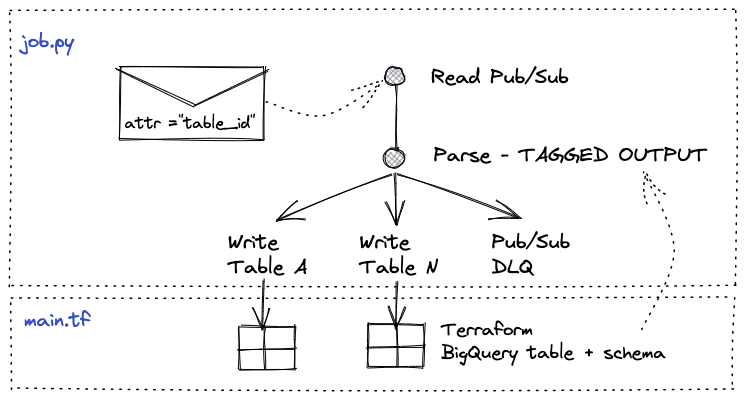

# Dataflow Demo

This implementation aims to leverage a single Dataflow job for data ingestion reading PubSub messages and writing them to multiple BigQuery tables as streaming inserts.



Each PubSub message is expected to include a BigQuery table ID stored as a message attribute. Note this solution could be extended to retrieve the table ID by some other means (e.g. event type) if need be.

At start time, the job parses the arguments and retrieves the list of existing tables from the `MetastoreService`. This `MetastoreService` instantiates a BQ client and offers functions to fetch all table_ids from the BQ dataset and fetch table schema from each table needed to write the messages to BigQuery.

Then, the job will read messages from PubSub and follow with a `DoFn` operation called `TagElementwithDestinationTable` that implements the following tagging logic:

1. Extract destination table from PubSub attribute in message.
2. If the destination table is one of the existing BigQuery tables, use TaggedOutput to tag the PubSub event to the correct BQ table. If the table does not exist, it sends the message to a dead letter PubSub topic.

Finally, the job generates one write task to BigQuery per table using streaming inserts from the list retrieved by the `MetastoreService`.

The solution can be bootstraped by following the steps described below.

## Requirements

This project will deploy all required GCP infrastructure and a dataflow template to trigger the job. All requirements are limited to:

- Google SDK.
- Terraform.
- Python Virtual Environment with Apache Beam to publish the dataflow template.

## Step 1: Create Python virtual environment

```sh
python -m venv env
source env/bin/activate
```

2 - Install dependencies:

```sh
pip install -r requirements.txt
```

## Step 2: Set up

Enable required Google APIs executing:

```sh
./scripts/enable_apis
```

## Step 3: Use Terraform to provision infrastructure and trigger dataflow job from template

All provisioning and execution is managed through Terraform.

Terraform will deploy:

- PubSub topic and subscription. This topic will recieve all messages, which must include a message attribute containing the BQ destination table id for the message.
- PubSub topic to manage any message without a known destination table (DLQ). User can chose to create another subscription to treat these type of message as best fits their scenario.
- BigQuery dataset and tables. A for_each loop is used to create tables based on the schema files included on the schemas folder.
- GCS bucket to store [Dataflow template](https://cloud.google.com/dataflow/docs/guides/templates/creating-templates) that wraps the pipeline code and any runtime parameters.
- Dataflow Service Account and all required role bindings.
- Dataflow job based on a classic template stored in GCS. The job uses the provided service account and worker configuration according to the sample security and org policies considered in this scenario: worker nodes cannot include External IPs and must be deployed in a subnet with a narrow set of open TCP ports.
- Logic to execute or recreate the dataflow job based on the dataflow template hosted on GCS upon any changes made to the schemas directory.
- VPC, subnet and firewall configuration to host Dataflow workers and ensuring only min required open ports.

Since the Dataflow job needs to have visibility of all possible tables where data can be stored at start up, this Terraform file includes a dependency graph between the different pieces of infrastructure so that when any new table is defined by the user, the Dataflow job will be recreated and will re-compute the job graph including new write sinks to deliver data to any new table.

To deploy the system using terraform run:

```sh
cd terraform

terraform init

terraform apply \
  -var gcp_project_id="<GCP_PROJECT_ID>" \
  -var region="<GCP_REGION>"
```

## Appendix: running the job locally

In order to run the job locally for development purposes, follow the steps described below (bear in mind this assumes all cloud resources have previously been deployed):

1 - Create Python virtual environment:

```sh
python -m venv env
source env/bin/activate
```

2 - Install dependencies:

```sh
pip install -r requirements.txt
```

3 - Run the job:

```sh
python -m dataflow.job --gcp_project_id='<GCP_PROJECT_ID>' --dataset_id='<DATASET_ID>' --subscription_id='<SUBSCRIPTION_ID>' --streaming
```

4 - Send messages to the topic to simulate some load:

```sh
gcloud pubsub topics publish projects/<GCP_PROJECT_ID>/topics/<TOPIC_NAME> \
  --message='{"column_one":"2222222"}' \
  --attribute=destination_table="example_table_one"
```

